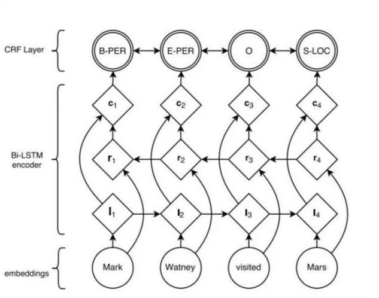

# 中文分词

中文分词是中文文本处理的一个基础步骤，也是中文人机自然语言交互的基础模块。不同于英文的是，中文句子中没有词的界限，因此在进行中文自然语言处理时，通常需要先进行分词，分词效果将直接影响词性、句法树等模块的效果。当然分词只是一个工具，场景不同，要求也不同。
在人机自然语言交互中，成熟的中文分词算法能够达到更好的自然语言处理效果，帮助计算机理解复杂的中文语言。

## 中文分词根据实现原理和特点，主要分为以下2个类别：

- 1、基于词典分词算法——也称为字符串匹配算法
  该算法是按照一定的策略将待匹配字符串和一个已经建立好的“充分大的”词典中的词进行匹配，若找到某个词，则说明匹配成功，识别了该词。常见的基于词典的分词算法分为以下几种：正向最大匹配法、逆向最大匹配法和双向匹配分词法等。
  基于词典的分词算法是应用最广泛、分词速度最快的。很长一段时间内研究者都在对基于字符串匹配方法进行优化，比如最大长度设定、字符串存储和查找方式以及对于词表的组织结构，比如采用TRIE索引树、哈希索引等。
- 2、基于统计的机器学习算法
  这类目前常用的算法是HMM, CRF, SVM, 深度学习等算法，比如standford, Hannlp分词工具是基于CRF算法。以CRF为例，基本思路是对汉字进行标注训练，不仅考虑了词语出现的频率，还考虑上下文，具备较好的学习能力，因此其对歧义词和未登陆词都具有良好的效果。
  Nianwen Xue在其论文《Combining Classifiers for Chinese Word Segmentation》中首次提出对每个字符进行标注，通过机器学习算法训练分类器进行分词，在论文《Chinese word segmentation as character tagging》中较为详细地阐述了基于字标注的分词法。常见的分词器都是使用机器学习算法和词典相结合，一方面能够提高分词准确率，另一方面能够改善领域适应性。

  随着深度学习的兴起，也出现了基于神经网络的分词器，例如有人员尝试使用双向LSTM+CRF实现分词器，其本质上是序列标注，所以有通用性，命名实体识别等都可以使用该模型，据报道其分词器字符准确率可高达97.5%。算法框架的思路与论文《Neural Architectures for Named Entity Recognition》类似，利用该框架可以实现中文分词，如下图所示：
  
  首先对语料进行字符嵌入，将得到的特征输入给双向LSTM，然后加一个CRF就得到标注的结果。

## 分词器当前存在的问题

目前中文分词难点主要有三个：
- 1、分词标准：比如人名，在哈工大的标准中，姓和名是分开的，但在Hanlp中是合在一起的。这需要根据不同的需求制定不同的分词标准。
- 2、歧义：对同一个待切分字符串存在多个分词结果，歧义又分为组合型歧义，交集型歧义和真歧义三种类型：
    - 2.1、组合型歧义：分词是有不同粒度的，指某个此条中的一部分也可以切分为一个独立的词条。比如“中华人名共和国”
    - 2.2、交集型歧义：在“郑州天和服装长中”，“天和”是厂名，是一个专有词，“和服”也是一个词，它们共用了“和”字。
    - 2.3、真歧义：本身的语法和语义都没有问题, 即便采用人工切分也会产生同样的歧义，只有通过上下文的语义环境才能给出正确的切分结果。例如：对于句子“美国会通过对台售武法案”，既可以切分成“美国/会/通过对台售武法案”，又可以切分成“美/国会/通过对台售武法案”。
**一般在搜索引擎中，构建索引时和查询时会使用不同的分词算法。常用的方案是，在索引的时候使用细粒度的分词以保证召回，在查询的时候使用粗粒度的分词以保证精度。**

- 3、新词：也称未被词典收录的词，该问题的解决依赖于人们对分词技术和汉语语言结构的进一步认识。

## 参考链接

- [知乎-竹间只能：有哪些比较好的中文分词方案？](https://www.zhihu.com/question/19578687/answer/828011367)