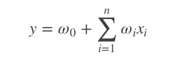

# 推荐系统

## 一、CTR预估

点击率(Click through rate) = 点击次数 / 展示次数
推荐系统中，是否进行推荐，需要根据预估的CTR来进行。在CTR预估中，常用的算法有FM、FFM、和DeepFM。

### FM(Factorization Machine)模型

FM(Factorization Machine)主要是为了解决数据稀疏的情况下，特征怎样组合的问题。已一个广告分类的问题为例，根据用户与广告位的一些特征，来预测用户是否会点击广告。数据如下：

clicked是分类值，表明用户有没有点击该广告。1表示点击，0表示未点击。而country,day,ad_type则是对应的特征。对于这种categorical特征，一般都是进行one-hot编码处理。将上面的数据进行one-hot编码以后，就变成了下面这样 :

one-hot之后，数据会变得非常稀疏，特征空间会变得很大（产生百万千万维的特征）。比如对item进行one-hot，如果有100w个item，就会产生100w个维度，而每个item只在其中一维的值为1。
此外，普通的线性模型各个特征是单独的：

但实际中很多特征之间有关联，比如电商广告中，男性用户更喜欢球类，女性用户更喜欢化妆品类等。需要发掘这些有关联的特征。
在FM模型中，考虑了特征之间的关联性，所以相比线性模型，多了后面的特征组合部分：

## 参考

- [1、知乎-DeepFM全方位解析 附Pytorch代码](https://zhuanlan.zhihu.com/p/84526966)
- [2、Github-推荐系统实战](https://github.com/lpty/recommendation)
- [3、Github-fire717/Recommendation-system](https://github.com/fire717/Recommendation-system)
- [4、Github-chocoluffy/deep-recommend-system](https://github.com/chocoluffy/deep-recommender-system)
- [5、Github-zhyfzy/Tantan-Recommend-Diversity提升推荐系统的多样性](https://github.com/zhyfzy/Tantan-Recommendation-Diversity)
- [6、Github-CheckChe0803/flink-recommendSystem-demo](https://github.com/CheckChe0803/flink-recommandSystem-demo)
- [7、知乎-推荐系统老司机的十条经验](https://zhuanlan.zhihu.com/p/23847246)
- [8、Github-wzhe06/Ad-papers——计算广告论文](https://github.com/wzhe06/Ad-papers)